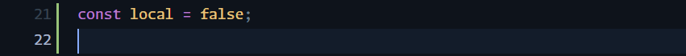

Esse é um projeto pessoal que tem como objetivo complementar e trazer um novo contexto para o projeto [MyfitnessPal++](https://github.com/Ieafyy/MyfitnessPal-). Aqui desenvolvi uma interface para que o sistema possa ser usado através de uma aplicação nativa para sistemas mobile.


O backend segue sendo o mesmo utilizado pelo sistema web, desenvolvido em python (e hospedado pelo Vercel). Para a criação do app usei React Native (typescript).

## Setup do ambiente

Para trazer essa solução para um ambiente mais real hospedei o backend na plataforma da vercel


Entretanto, essa alternativa nem sempre fica funcional e constantemente apresenta erros. Sendo assim, a melhor opção é rodar o backend localmente. Para que isso seja possível, no arquivo `index.tsx` altere o valor de `local` para true:



Agora basta iniciar o backend seguindo o mesmo passo a passo do [outro repositório](https://github.com/Ieafyy/MyfitnessPal-).

### Iniciando a aplicação

O sistema foi montado usando o expo para facilitar o compartilhamento e desenvolvimento. Para executar o sistema basta executar dentro da pasta raiz:

```bash
npx expo start
```

Se tudo tiver ok, o terminal irá apresentar um QR Code onde ao scanear usando o aplicativo do Expo Go no seu celular, irá executar o MFP no mesmo.


As funcionalidades são similares ao sistema web, com enfoque especial na parte de notificação aonde é alertado para o usuário sua meta e qual o estado que se encontra.
